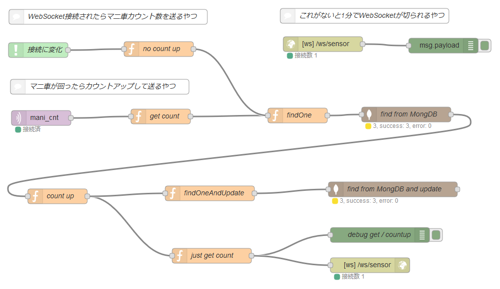

# IoTマニ車

マニ車を回すとクラウドサーバ上に功徳が積まれ、ブラウザでチェックできます。

<!--  -->
<!-- 動画 -->

## 1. ハードウェア
* WiFiマイコン: ESP8266 (ESPr Developerボード)
* IMUセンサ: MPU-6050 (上位互換のMPU-9250のブレークアウト基板を使用)
* 電源: LiPoバッテリー 1000mAh 1セル

<!--  -->

## 2. ファームウェア
### Arduinoスケッチ
* IotMani/IotMani.ino : スケッチ本体
* IotMani/Mani.cpp : マニ車回転検出処理
* IotMani/Iot.cpp : IoT通信処理
* IotMani/Setting.h : WiFiとMQTTの設定。(架空のものに変更されています。)

### 依存ライブラリ
* [I2Cdev](https://github.com/jrowberg/i2cdevlib/tree/master/Arduino/I2Cdev) : 下記MPU6050ライブラリが依存
* [MPU6050](https://github.com/jrowberg/i2cdevlib/tree/master/Arduino/MPU6050) : IMUセンサMPU-6050ドライバ
* [pubsubclient](https://github.com/knolleary/pubsubclient) : MQTTクライアント

## 3. バックエンド
* Heroku上にNode-REDで構築 (Node-REDはHerokuボタンからデプロイ)
* MQTTブローカーはCloudMQTTを使用 (Herokuのアドオンから使用)
* データベースはMongoDBを使用 (Herokuのアドオンから使用)

### Node-REDのフロー
* nodered/iotmani.json (MQTTとMongoDBは未設定です。)

## 4. フロントエンド
下記のファイルを適当なWebサーバー上に配置します。
### ファイル
* web/index.html
* web/iotmani.js (ソース中のアプリ名は架空のものに変更されています。'herokuapp'で検索してください)
* web/iotmani.css
* web/image/*.png (アニメーション表示用画像)
